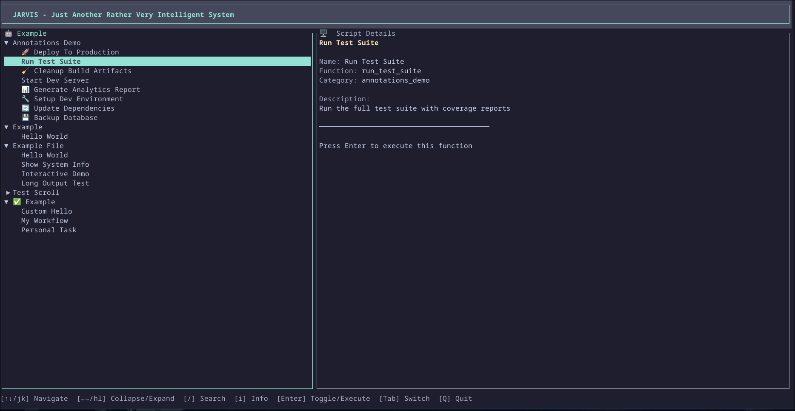

<div align="center">

# Jarvis

**Just Another Rather Very Intelligent System**

A beautiful TUI for managing and executing scripts with zero configuration.

[](https://github.com/Luckystrike561/jarvis/actions/workflows/build.yml)
[](LICENSE)
[](https://www.rust-lang.org/)



[Features](#features) • [Installation](#installation) • [Usage](#usage) • [Contributing](#contributing)

</div>

---

## Features

- **Zero Configuration** - Auto-discovers bash functions, npm scripts, devbox scripts, Taskfile tasks, Makefile targets, Justfile recipes, Cargo commands, Nx targets, and Terraform/OpenTofu commands
- **Beautiful TUI** - Modern terminal interface built with Ratatui
- **11 Built-in Themes** - Catppuccin Mocha/Macchiato/Frappe, Dracula, Nord, Tokyo Night, Solarized Dark, Gruvbox Dark, One Dark, Monokai, and Rose Pine with live preview picker
- **Multi-Language Support** - Works with `.sh` files, `package.json`, `devbox.json`, `Taskfile.yml`, `Makefile`, `justfile`, `Cargo.toml`, Nx workspaces (`nx.json`/`project.json`), and Terraform/OpenTofu (`.tf` files)
- **Single Binary** - Compile once, run anywhere

## Installation

### Quick Install (Recommended)

```bash
curl -fsSL https://raw.githubusercontent.com/Luckystrike561/jarvis/main/install.sh | bash
```

This will install Jarvis to `~/.local/bin`. You can customize the installation directory:

```bash
INSTALL_DIR=/usr/local/bin curl -fsSL https://raw.githubusercontent.com/Luckystrike561/jarvis/main/install.sh | bash
```

### Homebrew (macOS & Linux)

```bash
brew install https://raw.githubusercontent.com/Luckystrike561/jarvis/main/homebrew/jarvis.rb
```

### Nix Flakes

```bash
nix run github:Luckystrike561/jarvis
```

### Build from Source

```bash
git clone https://github.com/Luckystrike561/jarvis.git
cd jarvis
cargo build --release
sudo cp target/release/jarvis /usr/local/bin/
```

## Usage

```bash
# Run in current directory
jarvis

# Run in a specific directory
jarvis --path /path/to/project
```

### Keyboard Shortcuts

| Key | Action |
|-----|--------|
| `j/k` or `↑/↓` | Navigate |
| `h/l` or `←/→` | Collapse/Expand |
| `Enter` | Select/Execute |
| `/` | Search |
| `t` | Theme picker |
| `Tab` | Switch panes |
| `q` | Quit |

### Themes

Press `t` to open the theme picker. Use `↑/↓` to browse themes with live preview, `Enter` to apply, or `Esc` to cancel. Your selection is saved to `~/.config/jarvis/config.json` and persists across sessions.

**Built-in themes:** Catppuccin Mocha (default), Catppuccin Macchiato, Catppuccin Frappe, Dracula, Nord, Tokyo Night, Solarized Dark, Gruvbox Dark, One Dark, Monokai, Rose Pine.

## Script Discovery

Jarvis automatically discovers scripts in these locations:

- `./` - Current directory
- `./script/` or `./scripts/` - Script subdirectories  
- `./jarvis/` - Jarvis-specific scripts

### Supported Script Types

**Bash Functions** - Any `.sh` file with function definitions:

```bash
# deploy.sh
deploy_app() {
    echo "Deploying..."
}
```

**npm Scripts** - From `package.json`:

```json
{
  "scripts": {
    "build": "npm run build:app",
    "test": "jest"
  }
}
```

**Devbox Scripts** - From `devbox.json`:

```json
{
  "shell": {
    "scripts": {
      "build": "cargo build",
      "test": "cargo test"
    }
  }
}
```

**Task (go-task)** - From `Taskfile.yml`:

```yaml
version: '3'
tasks:
  build:
    desc: Build the project
    cmds:
      - cargo build
  test:
    desc: Run tests
    cmds:
      - cargo test
```

**Make** - From `Makefile`:

```makefile
# @emoji 🔨
# @description Build the project in debug mode
build:
	cargo build

# @emoji 🧪
# @description Run the test suite
test: build
	cargo test
```

**Just** - From `justfile`:

```just
# Build the project
build:
    cargo build

# Run tests
test: build
    cargo test
```

**Cargo** - From `Cargo.toml`:

Jarvis discovers common Cargo commands (build, test, run, clippy, fmt, etc.) when a `Cargo.toml` is present.

**Nx** - From Nx workspaces (`nx.json` / `project.json`):

Jarvis discovers Nx project targets in monorepo workspaces. Projects are grouped by name with their configured targets (build, test, lint, serve, etc.).

**Terraform / OpenTofu** - From `.tf` files:

Jarvis discovers Terraform or OpenTofu projects and provides common commands (init, plan, apply, destroy, validate, fmt). Workspaces are listed when more than one exists. Supports both `terraform` and `tofu` binaries with automatic detection.

> **Note:** Task support requires the `task` binary to be installed. See [taskfile.dev](https://taskfile.dev) for installation instructions.

> **Note:** Make support requires the `make` binary to be installed. It is pre-installed on most Unix systems.

> **Note:** Just support requires the `just` binary to be installed. See [just.systems](https://just.systems) for installation instructions.

> **Note:** Cargo support requires the `cargo` binary (part of the Rust toolchain). See [rustup.rs](https://rustup.rs) for installation instructions.

> **Note:** Nx support requires the `npx` binary (part of Node.js/npm). See [nodejs.org](https://nodejs.org) for installation instructions.

> **Note:** Terraform/OpenTofu support requires the `terraform` or `tofu` binary. Jarvis checks for `terraform` first and falls back to `tofu`. See [terraform.io](https://www.terraform.io) or [opentofu.org](https://opentofu.org) for installation instructions.

### Function Annotations

Customize how functions appear in the TUI using special comment annotations:

**Bash scripts:**

```bash
# @emoji 🚀
# @description Deploy to production
deploy_production() {
    echo "Deploying..."
}

# @ignore
_helper_function() {
    # Hidden from TUI
}
```

**Taskfile tasks:**

```yaml
version: '3'
tasks:
  # @emoji 🚀
  # @description Deploy the application to production
  deploy:
    cmds:
      - ./deploy.sh

  # @ignore
  _internal_helper:
    cmds:
      - echo "helper"
```

**Makefile targets:**

```makefile
# @emoji 🚀
# @description Deploy the application to production
deploy:
	./deploy.sh

# @ignore
_internal_helper:
	@echo "helper"
```

**Justfile recipes:**

```just
# @emoji 🚀
# @description Deploy the application to production
deploy:
    ./deploy.sh

# @ignore
_internal_helper:
    @echo "helper"
```

| Annotation | Description |
|------------|-------------|
| `@emoji <emoji>` | Display emoji prefix in the TUI |
| `@description <text>` | Custom description for the details panel |
| `@ignore` | Hide the function/task from the TUI |

## Development

```bash
# Using Devbox (recommended)
devbox shell
devbox run dev      # Build and run
devbox run test     # Run tests
devbox run check    # Lint + format check

# Manual
cargo build
cargo test
cargo clippy
```

## Contributing

Contributions are welcome! Please see [CONTRIBUTING.md](CONTRIBUTING.md) for guidelines.

## License

MIT License - see [LICENSE](LICENSE) for details.

---

<div align="center">

Built with [Ratatui](https://github.com/ratatui-org/ratatui)

</div>
